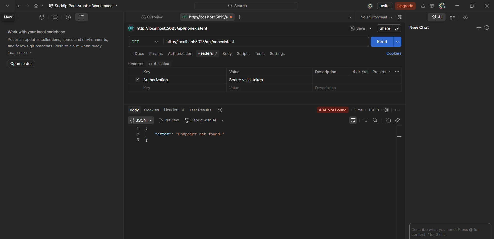
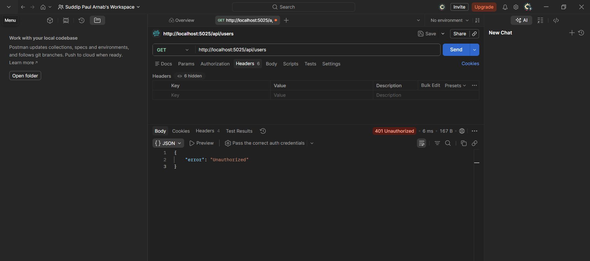
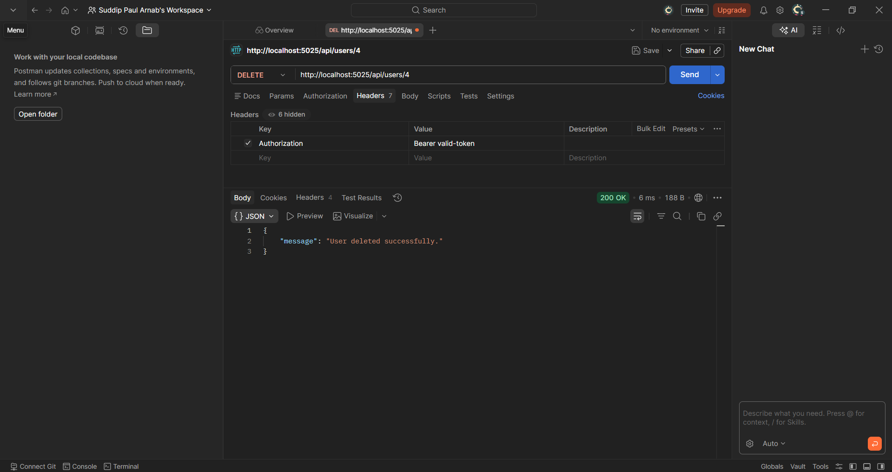
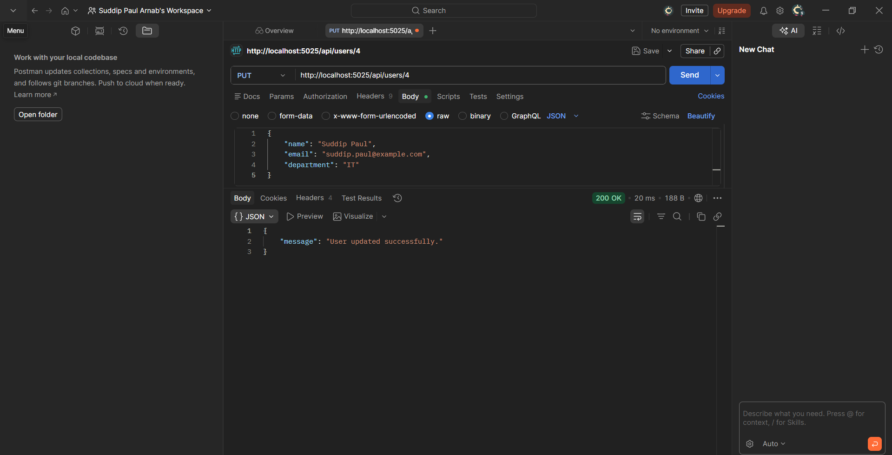
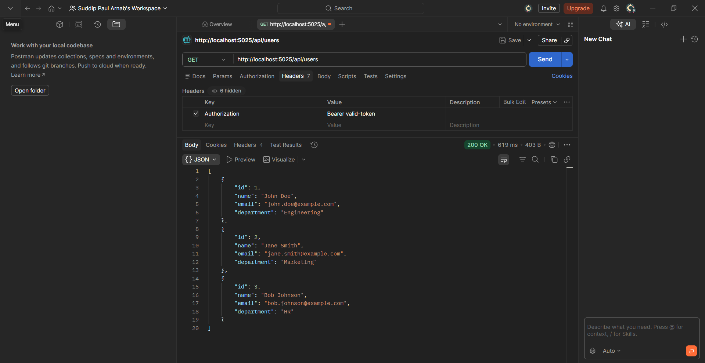
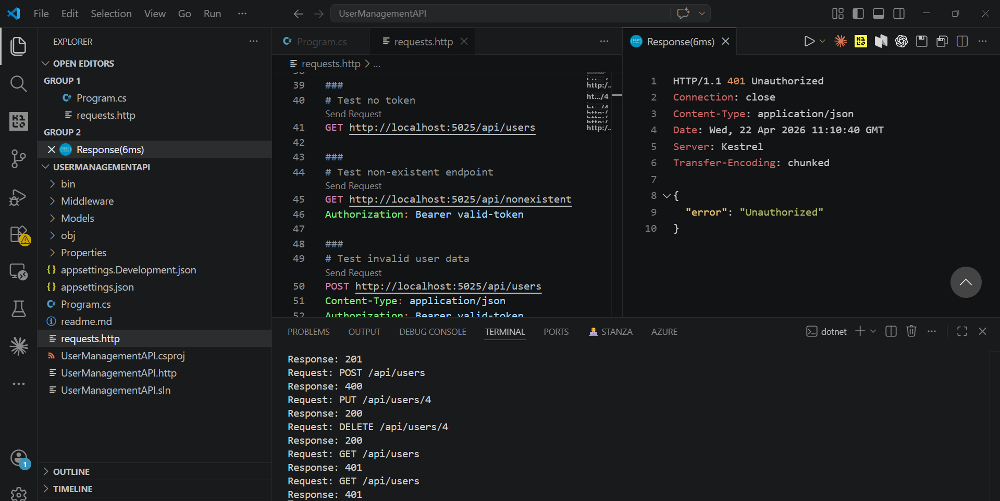
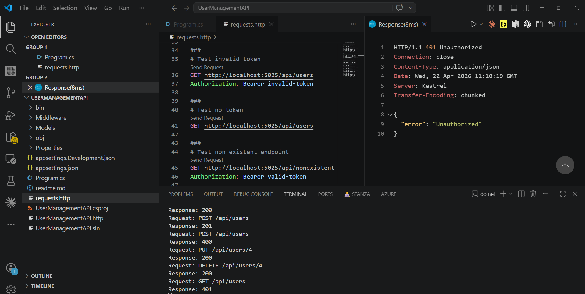
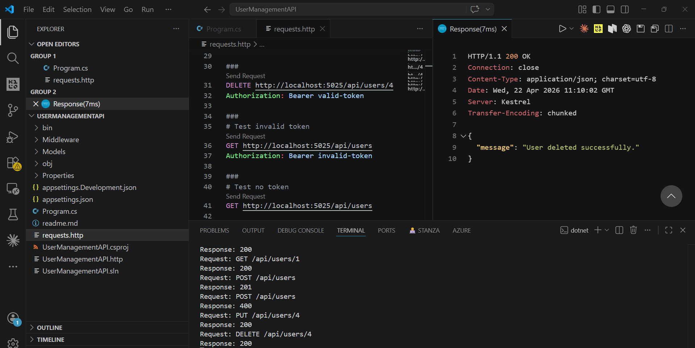
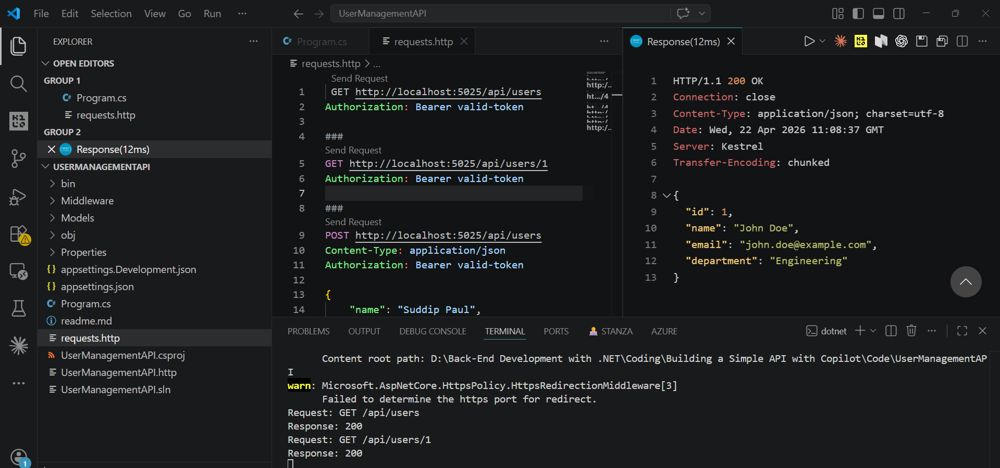
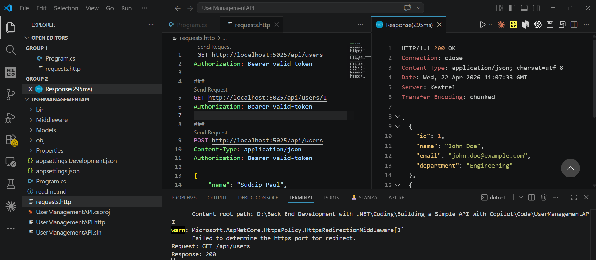

# User Management API

A simple ASP.NET Core Web API for managing users with middleware for logging, error handling, and authentication.

## Features

- CRUD operations for users
- Input validation
- Middleware for logging, authentication, and error handling
- JSON responses for all endpoints

## Prerequisites

- .NET 10.0 SDK
- Visual Studio Code or any IDE supporting .NET

## Installation

1. Clone or download the project.
2. Navigate to the project directory: cd UserManagementAPI
3. Restore dependencies: `dotnet restore`

## Running the Application

1. Build the project: `dotnet build`
2. Run the application: `dotnet run`
3. The API will be available at `http://localhost:5025`

## API Endpoints

All endpoints require `Authorization: Bearer valid-token` header.

### GET /api/users
Retrieves all users.

### GET /api/users/{id}
Retrieves a specific user by ID.

### POST /api/users
Creates a new user. Requires JSON body with name, email, department.

### PUT /api/users/{id}
Updates an existing user.

### DELETE /api/users/{id}
Deletes a user by ID.

## Testing

Use the requests.http file in VS Code with REST Client extension to test endpoints.

## Middleware

- **LoggingMiddleware**: Logs requests and responses.
- **ErrorHandlingMiddleware**: Catches exceptions and returns JSON errors.
- **AuthenticationMiddleware**: Validates Bearer tokens.

## Project Structure

- Models: Contains data models (User.cs)
- Middleware: Contains middleware classes
- Program.cs: Main application file
- requests.http: Test requests
 
## Request Examples (screenshots)

Screenshots showing how to run and inspect the API requests and responses are included in the `requestFig` folder. There are two sets:

- **POSTMAN**: screenshots showing requests and responses in Postman.
- **VSCODE**: screenshots showing requests and responses using the VS Code REST client and terminal output.

### Postman screenshots

### VS Code screenshots

## Compact gallery by request

This table maps each request from `requests.http` (1–9) to the endpoint tested, the result shown in the response, and links to the Postman / VS Code screenshots.

| Req | Endpoint (method) | Result shown | Postman | VS Code |
|---:|---|---|---:|---:|
| 1 | `GET /api/users` | 200 OK — list of users |  |  |
| 2 | `GET /api/users/1` | 200 OK — single user |  |  |
| 3 | `POST /api/users` | 201 Created — new user (id 4) |  |  |
| 4 | `PUT /api/users/4` | 200 OK — update message |  |  |
| 5 | `DELETE /api/users/4` | 200 OK — delete message |  |  |
| 6 | `GET /api/users` (invalid token) | 401 Unauthorized |  |  |
| 7 | `GET /api/users` (no token) | 401 Unauthorized |  |  |
| 8 | `GET /api/nonexistent` | 404 Not Found — JSON error |  |  |
| 9 | `POST /api/users` (invalid data) | 400 Bad Request — validation error |  |  |

Notes:
- Thumbnails link to the images stored in `requestFig/POSTMAN` and `requestFig/VSCODE`.
- Use the `requests.http` file to reproduce each request; the README's examples follow that same numbering.